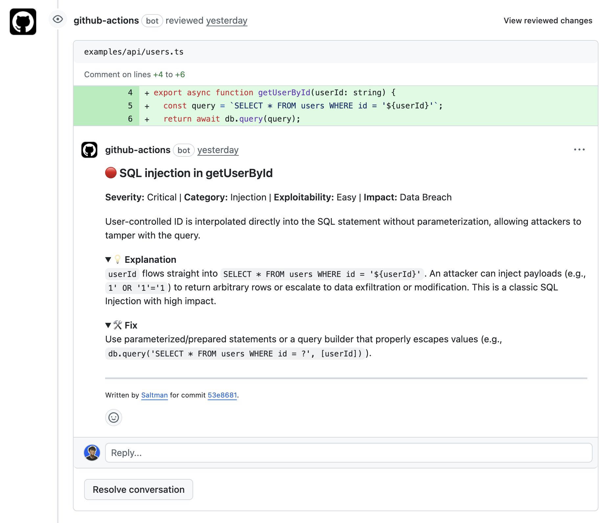

# Saltman

A GitHub Action that analyzes code changes for security vulnerabilities and posts findings as PR comments or GitHub issues.



> **Note:** Saltman is currently focused on security-related code review. Future versions may expand to cover other areas such as performance, code quality, and best practices.

## Table of Contents

- [Requirements](#requirements)
- [Quick Start](#quick-start)
- [Features](#features)
- [Tech Stack](#tech-stack)
- [Usage](#usage)
  - [Publishing Your Action](#publishing-your-action)
  - [PR Mode (Default)](#pr-mode-default)
  - [Push Mode (Create Issues)](#push-mode-create-issues)
  - [OpenAI-Compatible Provider](#openai-compatible-provider)
  - [Inputs](#inputs)
- [Development](#development)
  - [Setup](#setup)
  - [Build](#build)
  - [Testing](#testing)
- [Why GitHub Action Instead of GitHub App?](#why-github-action-instead-of-github-app)
- [Limitations](#limitations)
- [License](#license)

## Requirements

- A GitHub repository
- An API key from one of the supported LLM providers (OpenAI, Anthropic, or OpenAI-compatible)
- GitHub Actions enabled in your repository

## Quick Start

Add this to your `.github/workflows/security-review.yml`:

```yaml
name: Security Review

on:
  pull_request:
    types: [opened, synchronize]

jobs:
  review:
    runs-on: ubuntu-latest
    permissions:
      pull-requests: write
      contents: read
    steps:
      - uses: actions/checkout@v4
      - uses: adriangohjw/saltman@v1
        with:
          github-token: ${{ secrets.GITHUB_TOKEN }}
          provider: openai
          api-key: ${{ secrets.OPENAI_API_KEY }}
```

## Features

- **PR Mode**: Triggers on PR creation and when new commits are pushed to a PR
  - Posts inline comments for critical/high severity issues
  - Posts aggregated comments for medium/low/info issues
  - Supports configurable pings via `ping-users` input
- **Push Mode**: Triggers on direct pushes to a specific branch
  - Creates one GitHub issue per finding when any findings are detected (all severities)
  - Automatically pings the commit pusher
  - Supports configurable additional pings via `ping-users` input
  - Automatically skips commits that are associated with pull requests (prevents duplicate issues)
  - Only runs when the pushed branch matches the specified `target-branch`
- **AI-powered security code review** using OpenAI (recommended), Anthropic Claude Opus, or any OpenAI-compatible API provider - focused on identifying security vulnerabilities and risks
- **File ignore patterns** - Exclude files from analysis using glob patterns (similar to `.eslintignore` or `.gitignore`)
- **Severity filtering** - Filter issues by severity level (critical, high, medium, low, info) to focus on specific risk levels

## Tech Stack

Saltman is built with modern TypeScript and leverages the following technologies:

### Core
- 🔷 **TypeScript** - Type-safe development with ES2020 target
- 🚀 **Bun** - Fast JavaScript runtime and package manager
- ⚙️ **GitHub Actions** - Composite action for seamless integration

### LLM Integration
- 🤖 **OpenAI SDK** - Primary LLM provider for code analysis
- 🧠 **Anthropic SDK** - Alternative provider support (Claude Opus)
- 🔌 **Vercel AI SDK** - Unified AI SDK with OpenAI-compatible provider support for flexible model integration

### GitHub Integration
- 📦 **@actions/core** - GitHub Actions core utilities
- 🐙 **@actions/github** - GitHub API client for PRs, issues, and comments

### Utilities
- ✅ **Zod** - Runtime type validation and schema validation
- 🔍 **minimatch** - Glob pattern matching for file filtering

### Development Tools
- 🔎 **oxlint** - Ultra-fast Rust-based linter for JavaScript and TypeScript
- 🎨 **oxfmt** - High-performance Rust-based code formatter

## Usage

### Publishing Your Action

Before others can use your action, you need to:

1. **Push your repository to GitHub** (make it public or ensure users have access)
2. **Create a version tag** - users will reference `@v1` (or your version tag) to get a stable version

### PR Mode (Default)

Analyze pull requests and post comments directly on the PR:

```yaml
name: 'Analyze PR'

on:
  pull_request:
    types: [opened, synchronize]

jobs:
  analyze:
    runs-on: ubuntu-latest
    permissions:
      pull-requests: write
      contents: read
      issues: write
    steps:
      - name: Checkout code
        uses: actions/checkout@v4

      - name: Run Saltman
        uses: adriangohjw/saltman@v1
        with:
          github-token: ${{ secrets.GITHUB_TOKEN }}
          provider: openai  # Must be either "openai", "anthropic", or "openai-compatible". OpenAI is recommended.
          api-key: ${{ secrets.OPENAI_API_KEY }}  # API key for the specified provider
          model: gpt-5.1-codex-max  # Optional: choose model (defaults to gpt-5.1-codex-mini for OpenAI, claude-opus-4-5 for Anthropic)
          post-comment-when-no-issues: true  # Optional: set to true to post analysis as PR comment when no issues are detected (defaults to false)
          ping-users: |  # Optional: users/teams to ping in PR comments
            @team/security
            @security-leads
          ignore-patterns: |  # Optional: exclude files from analysis using glob patterns
            **/*.test.ts
            **/*.spec.ts
            **/node_modules/**
            examples/**
          severity-filter: |  # Optional: only show specific severity levels (defaults to all if unspecified)
            critical
            high
```

### Push Mode (Create Issues)

Monitor direct pushes to a specific branch and create GitHub issues. In push mode, the action:
- Creates **one GitHub issue per finding** (for all severities: critical, high, medium, low, info)
- Only creates issues when findings are detected (no issues created when no findings are found)
- Automatically skips commits that are associated with pull requests to prevent duplicate issues
- Only runs when the pushed branch matches the `target-branch` you specify
- Automatically labels issues with `security`, `saltman`, and the severity level
- Issue titles include an emoji and location information (e.g., "🔴 SQL Injection in src/auth.ts:42")

```yaml
name: 'Security Review on Push to Main'

on:
  push:
    branches: [main]

jobs:
  security-review:
    runs-on: ubuntu-latest
    permissions:
      contents: read
      issues: write
    steps:
      - name: Checkout code
        uses: actions/checkout@v4

      - name: Run Saltman
        uses: adriangohjw/saltman@v1
        with:
          github-token: ${{ secrets.GITHUB_TOKEN }}
          provider: openai  # Must be either "openai", "anthropic", or "openai-compatible". OpenAI is recommended.
          api-key: ${{ secrets.OPENAI_API_KEY }}  # API key for the specified provider
          target-branch: main  # Required for push mode: branch to monitor
          ping-users: |  # Optional: users/teams to ping (works in both PR and push modes)
            @team/security
            @security-leads
          ignore-patterns: |  # Optional: exclude files from analysis using glob patterns
            **/*.md
            package.json
            bun.lockb
          severity-filter: |  # Optional: only show specific severity levels (defaults to all if unspecified)
            critical
            high
```

**Note:** Replace `adriangohjw/saltman@v1` with your own repository path. Using `@v1` will use the v1 tag, providing a stable version reference.

### Model Selection

You can optionally specify which model to use for OpenAI and Anthropic providers:

**OpenAI Models:**
- `gpt-5.1-codex-mini` (default) - Fastest and most cost-effective
- `gpt-5.1-codex-max` - More powerful, better for complex codebases
- `gpt-5.2-codex` - Latest model with enhanced capabilities

**Anthropic Models:**
- `claude-opus-4-5` (default) - Most capable model
- `claude-sonnet-4-5` - Balanced performance and speed
- `claude-haiku-4-5` - Fastest and most cost-effective

Example with model selection:

```yaml
- name: Run Saltman
  uses: adriangohjw/saltman@v1
  with:
    github-token: ${{ secrets.GITHUB_TOKEN }}
    provider: openai
    api-key: ${{ secrets.OPENAI_API_KEY }}
    model: gpt-5.1-codex-max  # Optional: choose a specific model
```

If you don't specify a model, the default will be used (`gpt-5.1-codex-mini` for OpenAI, `claude-opus-4-5` for Anthropic).

### OpenAI-Compatible Provider

You can use any OpenAI-compatible API provider (e.g., local models, self-hosted solutions, or other cloud providers):

```yaml
name: 'Analyze PR with OpenAI-Compatible Provider'

on:
  pull_request:
    types: [opened, synchronize]

jobs:
  analyze:
    runs-on: ubuntu-latest
    permissions:
      pull-requests: write
      contents: read
      issues: write
    steps:
      - name: Checkout code
        uses: actions/checkout@v4

      - name: Run Saltman
        uses: adriangohjw/saltman@v1
        with:
          github-token: ${{ secrets.GITHUB_TOKEN }}
          provider: openai-compatible  # Use OpenAI-compatible provider
          api-key: ${{ secrets.OPENAI_COMPATIBLE_API_KEY }}  # API key for your provider
          base-url: https://api.example.com/v1  # Base URL for your OpenAI-compatible API
          model: gpt-4  # Model name to use (e.g., "gpt-4", "gpt-3.5-turbo", or your custom model name)
```

**Note:** When using `provider: openai-compatible`, both `base-url` and `model` are required.

### Inputs

| Input | Required | Mode | Description |
|-------|----------|------|-------------|
| `github-token` | ✅ Yes | Both | GitHub token for API access. Use `${{ secrets.GITHUB_TOKEN }}` for automatic token. |
| `provider` | ✅ Yes | Both | LLM provider to use for code review. Must be either `"openai"`, `"anthropic"`, or `"openai-compatible"`. **OpenAI is recommended** for better performance and reliability. |
| `api-key` | ✅ Yes | Both | API key for the specified LLM provider. Store this as a secret in your repository settings (e.g., `OPENAI_API_KEY`, `ANTHROPIC_API_KEY`, or your custom provider's API key). |
| `base-url` | Conditional | Both | Required when `provider` is `"openai-compatible"`. Base URL for your OpenAI-compatible API endpoint (e.g., `https://api.example.com/v1` or `http://localhost:1234/v1`). |
| `model` | Optional | Both | Model name to use. For OpenAI: `gpt-5.1-codex-mini` (default), `gpt-5.1-codex-max`, or `gpt-5.2-codex`. For Anthropic: `claude-sonnet-4-5`, `claude-haiku-4-5`, or `claude-opus-4-5` (default). Required when `provider` is `"openai-compatible"`. |
| `post-comment-when-no-issues` | ❌ No | PR only | Whether to post the analysis as a comment on the PR when no issues are detected. Must be `true` or `false` if specified. Defaults to `false`. **Mutually exclusive with `target-branch`**. |
| `target-branch` | ❌ No | Push only | Branch name to monitor for direct pushes. When set and action is triggered on a push event, creates a GitHub issue instead of PR comments. The action will only run when someone pushes directly to this branch. **Mutually exclusive with `post-comment-when-no-issues`**. |
| `ping-users` | ❌ No | Both | Space or newline-separated list of GitHub usernames or teams to ping. All items must start with `@`. In PR mode, these are added to PR comment footers. In push mode, these are added to issue footers along with the commit pusher. All mentions are automatically deduplicated. |
| `ignore-patterns` | ❌ No | Both | Newline-separated list of glob patterns to exclude files from analysis. Similar to `.eslintignore` or `.gitignore` patterns. Files matching any pattern will be skipped during analysis. |
| `severity-filter` | ❌ No | Both | Space or newline-separated list of severity levels to include in the review. Valid values: `critical`, `high`, `medium`, `low`, `info`. If unspecified, all severities are shown. All values must be valid severity levels. |

**Examples:**

```yaml
# ping-users example
ping-users: |
  @team/security
  @security-leads
  @user1

# ignore-patterns example
ignore-patterns: |
  **/*.test.ts
  **/*.spec.ts
  **/node_modules/**
  examples/**
  *.md

# severity-filter example (only show critical and high severity issues)
severity-filter: |
  critical
  high
```

**Mode Selection:**

The mode is determined by the GitHub event that triggers the action:

- **PR Mode**: Triggered by `pull_request` events (e.g., `on: pull_request: types: [opened, synchronize]`). Creates PR comments.
  - Use `post-comment-when-no-issues` to optionally post a comment when no issues are detected
  - Use `ping-users` to ping specific users/teams in PR comments (all severities)
- **Push Mode**: Triggered by `push` events (e.g., `on: push: branches: [main]`). Creates GitHub issues.
  - Use `target-branch` to specify which branch to monitor (the action only runs when the pushed branch matches)
  - In push mode, the action automatically:
    - Pings the person who pushed the commit
    - Pings any additional users/teams specified in `ping-users`
    - All mentions are automatically deduplicated
    - Issues are only created when findings are detected (unlike PR mode, `post-comment-when-no-issues` does not apply)

**Note:** The inputs `post-comment-when-no-issues` and `target-branch` are mutually exclusive - you cannot use both in the same workflow, as they configure different behaviors for different event types.

## Development

### Setup

```bash
bun install
```

### Build

```bash
bun run build
```

This compiles TypeScript to JavaScript in the `dist/` directory.

### Testing

The action includes test workflows (`.github/workflows/test-pr.yml` and `.github/workflows/test-push.yml`) that you can use to test the action in your repository.

## Why GitHub Action Instead of GitHub App?

Saltman is designed as a **GitHub Action** rather than a GitHub App for several important reasons:

- **Runs on your infrastructure**: The action executes on your own GitHub Actions runners, giving you full control over the execution environment and compute resources
- **Privacy & Security**: Your code never leaves your GitHub Actions environment (except to the LLM API you configure). No need to trust a third-party service with repository access
- **No external dependencies**: You don't need to install or grant permissions to external apps. The action only uses the permissions you explicitly grant in your workflow
- **Cost control**: You manage costs through your GitHub Actions usage, not through a hosted service's pricing model
- **Transparency**: The code is open source and runs transparently in your workflows - you can see exactly what it does
- **Customization**: You can fork and modify the action to fit your specific needs
- **No third-party rate limits**: Only subject to GitHub Actions limits and your chosen LLM API provider's limits

## Limitations

- **Requires API key**: You need an active API key from an LLM provider (OpenAI, Anthropic, or compatible)
- **API costs**: Each analysis consumes LLM API tokens, which may incur costs
- **False positives**: AI-powered analysis may occasionally flag false positives - always review findings
- **Text files only**: Only analyzes text-based source code files

## License

MIT License
